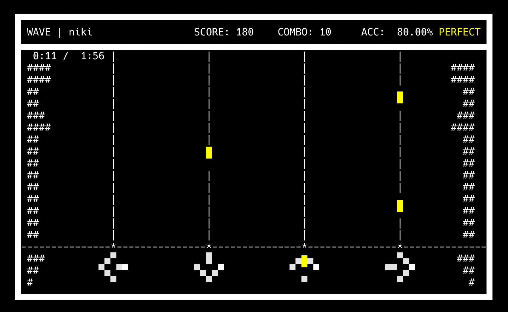

### LKRhythm II: A Terminal-Based Rhythm Game
#### By LemonKat

This is a rhythm game I've made, using a terminal display system. Well, it's the second version, the original was kind of a mess.
In a way, this is one of my longest-running projects, as it can trace its lineage to a file in a different game from 3 years ago. 

It works in a similar way to Dance Dance Revolution. I built a big cardboard arcade cabinet and a custom arrow pad out of aluminum foil and cardboard. My laptop fits inside the cabinet and runs the game on a terminal window. However, you can just play the game using WASD and space.

This game runs using a new and improved version of the display_grid system that I used in several previous projects. The backend has been switched, many of the bugs have been patched, and there's a few new features here and there. display_grid is now a separate repository, and can be found here: https://github.com/lemonkat/display_grid. I'll get around to updating my older projects to use it soon.

I also made my own stepcharts, huge thanks to the Project OutFox community for their advice on how to make stepcharts.

###### How to Play
to run:
run `python3 game.py` in a terminal window that is at least 80 characters wide and 24 characters tall.

The menus are navigated only using WASD and space. During gameplay, use WASD to hit notes and space to pause.

###### Hardware
I also built a custom arrow pad out of cardboard and aluminum foil. If you build your own, in the `hardware` directory I have CircuitPython scripts. Simply connect the player to an AdaFruit CPX's GND pin and up, left, down, and right arrows to pins A5, A7, A3, and A1, respectively, install the `main_code` script and its dependencies, and plug the board into your laptop.

If you want a track to be added, contact me at lemonkatto@gmail.com

###### Copyright & Licensing
The game engine is licensed under MIT. Song data and step-charts are the intellectual property of their respective creators/mappers. This project is not affiliated with SEGA or Project SEKAI.